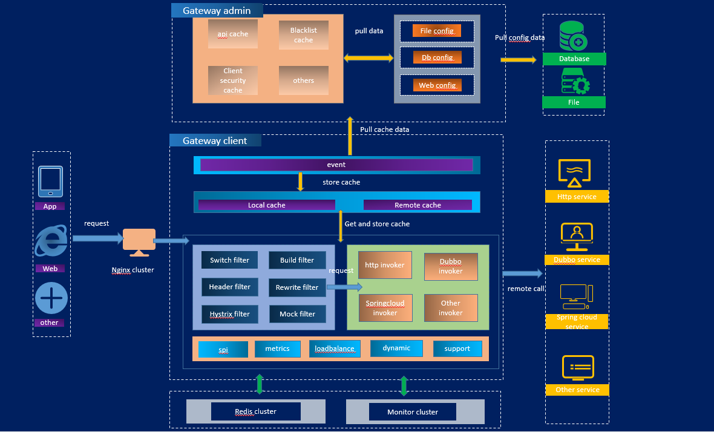

  

  <strong>clivia是一款基于spring webflux的可扩展、高性能、高弹性、响应式的 api gateway</strong>

  <strong>clivia_V0.0.1</strong>

--------------------------------------------------------------------------------
#  架构概览

# 模块介绍

- clivia-admin-core : 网关配置管理后台核心模块

- clivia-client-core : 网关核心模块

- clivia-example : 开箱即用的实例

- clivia-event : 系统事件入口模块

- clivia-api : 基础api信息模块

- clivia-cache : 系统缓存模块

- clivia-dynamic : 基于groovy的动态代码文件加载模块

- clivia-filter : 可扩展的系统过滤器集合模块

- clivia-invoke : 可扩展的系统执行器集合模块

- clivia-loadbalance : 内置可扩展的负载均衡策略模块

- clivia-assembly-base : 系统中间件模块(redis、metrics、httpClient)

- clivia-spi : 系统spi模块

- clivia-support : 系统公共支撑模块
--------------------------------------------------------------------------------

# 特点

- 支持多种API配置方式，例如数据库、文件、可视化界面方式(规划中)配置API信息；支持系统/接口级别的服务接入
- 系统具备安全验证、黑名单、验签、限流、url重写、熔断、mock、header、系统开关等常用过滤器；具备http、dubbo、spring cloud、websocket等类型rpc转发功能
- 系统具备高弹性，在不停机的情况下支持基于groovy的代码文件加载
- 模块划分清晰；扩展性强，具有完善的扩展机制
- 支持高可用集群及灰度发布
--------------------------------------------------------------------------------
# 系统介绍

## 1、API信息的配置

- 数据库配置方式请参考/script/apiCconfig.docx
- 文件配置方式请参考/script/fileConfig/fileConfig.md
- web配置方式(规划中)

--------------------------------------------------------------------------------

## 2、缓存&数据同步

- spring
  框架启动后会进行clivia-event模块调用，clivia-event会加载clivia-cache模块DefaultCliviaCacheManager类中的initCache方法，完成全量API配置/黑名单/filter/invoker的加载，并放入CliviaCacheFactory进行缓存。在首次加载完成后，系统会定时进行缓存增量更新
- CliviaCacheFactory目前有三种缓存实现，分别为CliviaStandandCacheFactory(直接将数据更新到内存),CliviaLocalCacheFactory(分离式内存缓存更新)
  ,CliviaRemoteCacheFactory(分离式远程缓存，待完善)
- API配置/黑名单配置的数据同步机制：clivia-cache模块通过http请求clivia-admin模块，clivia-admin 优先从本地缓存获取数据并响应该请求。

--------------------------------------------------------------------------------

## 3、弹性

- 在网关运行期间，可在不停机的情况下将测试完成的groovy动态代码文件放置在扫描目录下，系统将自动定时扫描该目录下的文件，并进行编译和加载
- 目前支持filter和invoker的弹性加载，如有定制化需要，可参考clivia-dynamic
--------------------------------------------------------------------------------
## 4、过滤器

- 目前内置了多种网关过滤器，包括安全验证、黑名单、验签、限流、重写、熔断、header、mock、系统开关等，后续将持续添加更多过滤器
- 定制化的方式：1、新增自定义过滤器模块，实现CliviaFilter接口并重新进行编译；2、通过加载动态文件的方式完成扩展定制。
--------------------------------------------------------------------------------
## 5、执行器

- 执行器提供不同Rpc下游服务转发，目前支持dubbo、http、spring cloud、websocket，后续可以添加更多执行器
- 定制化的方式同过滤器
--------------------------------------------------------------------------------
## 6、安全设计

- 网关与配置管理端均使用token的方式进行单向交互
- 网关提供请求的appKey校验以及请求数据验签
--------------------------------------------------------------------------------
# Getting started

* 1、clone project （gitee或者github）
~~~
 git clone https://gitee.com/palading_cr/clivia.git
~~~
~~~
 git clone https://github.com/palading123/clivia.git
~~~

* 2、Building

~~~
   mvn clean install
~~~

* 3、准备网关元数据(以文件配置方式为例)
  #####  /script/fileConfig/目录下的三个json文件copy到本地磁盘下，特别需要注意的地方有两点：
  ###### 1、json配置文件需要放到和clivia-gateway-admin同一台机器下，集群环境也是如此，也需要确保clivia-gateway-admin有权限读取配置文件
  ###### 2、如果json配置文件目录为D://opt//clivia//gateway//,clivia-gateway-admin配置文件(application.properties)中的属性clivia.admin.config.absoluteFilePath=D://opt//clivia//gateway//
  ###### 3、具体属性含义请参考

* 4、确保clivia-gateway-client可连通clivia-gateway-admin
  ###### clivia-gateway-client配置文件中的clivia.server.config.cliviaAdminUrl属性为clivia-gateway-admin的地址
~~~
  clivia.server.config.cliviaAdminUrl=http://localhost:1023
~~~

* 5、run(先后启动clivia-example下的admin和client子工程,默认端口分别为1023和8099)
  ###### 需要先启动clivia-gateway-admin
~~~
     java -jar clivia-gateway-admin-0.0.1.jar
     java -jar clivia-gateway-client-0.0.1.jar
~~~
  ###### client启动成功时会显示clivia的logo：
 
   ~~~
   _____ _      _______      _______
/ ____| |    |_   _\ \    / /_   _|   /\
| |    | |      | |  \ \  / /  | |    /  \
| |    | |      | |   \ \/ /   | |   / /\ \
| |____| |____ _| |_   \  /   _| |_ / ____ \
\_____|______|_____|   \/   |_____/_/    \_\
:: clivia ::    (v0.0.1)

~~~

* test
###### 我在clivia-gateway-admin中内置了一个测试的TestController,可以测试get和post请求，curl命令如下:
###### 1、get
~~~
curl --location --request GET 'localhost:8099/clivia-server/api/get?test=reganmian' \
--header 'group: 1' \
--header 'version: V0.0.1' \
--header 'appKey: appKey1'
~~~
###### 2、post
 ~~~
 curl --location --request POST 'localhost:8099/clivia-server/api/post' \
--header 'group: 1' \
--header 'version: V0.0.1' \
--header 'appKey: appKey1' \
--header 'Content-Type: application/json' \
--data-raw '{"name":"小陈","value":"25岁","house":{"houseAddr":"武汉","houseName":"光谷未来城"},"a":null,"c":null}'
 ~~~

# 交流
欢迎您加入到clivia交流群。
QQ群 1：**574835875**

# 协议

- clivia遵从许可证 [ Apache License Version 2.0](https://www.apache.org/licenses/LICENSE-2.0)
--------------------------------------------------------------------------------
# 关于

- 2021年3月后，作者个人利用零散的节假日时间完成了项目设计以及各模块的开发,劳烦大家star,让更多人关注到clivia。
作者最大的愿望是该项目能够让使用者受益,同时也希望开源社区爱好者能够一起完善该项目,争取早日能够将项目推进到release阶段。
--------------------------------------------------------------------------------

